What is Cygwin?
---

Cygwin is a large collection of GNU and Open Source tools which provide functionality similar to a Linux distribution on Windows. These have all been built from source to work with Cygwin on Windows.

Introduction
---

In this tutorial we will be installing these programs for a complete `lftp` experience:

**1:** `Cygwin x64` - the core program and services for Windows 10 x64.

**2:** `lftp` - sophisticated file transfer program.

**3:** `openssh` - The SSH server so that we can use SFTP with lftp

**4:** `cron` - So that we can create and run cronjob with our Cygwin terminal

**5:** `nano` - a simple text editor that is used often in tutorials and is therefore familiar.

**6:** `screen` - To run programs in the background allowing use to close the terminal.

**7:** `wget` - To download required files hosted externally.

**8:** `cygrunsrv` - To run cronjob as a windows service.

> **Important note:** `openssl` is installed by default.

Installing Cygwin on Windows using lftp as an example.
---

The first step is to go to the Cygwin website and download the version you want. We will be using the `x64` version for this tutorial. At this point you can choose the version that suits your platform or needs as they are interchangeable for this tutorial.

Download - [Cygwin x86 32bit](https://www.cygwin.com/setup-x86.exe)

Download - [Cygwin x64 64bit](https://www.cygwin.com/setup-x86_64.exe)

Once you have downloaded the version you require we can start the installation process.

Cygwin Installation
---

Find the installer and run it.

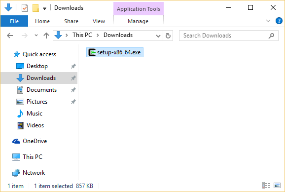

You will be asked to allow the program to install, choose `Run`

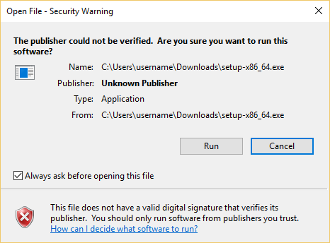

**Recommended:** If you are asked to allow the program to install by UAC then choose `Yes`

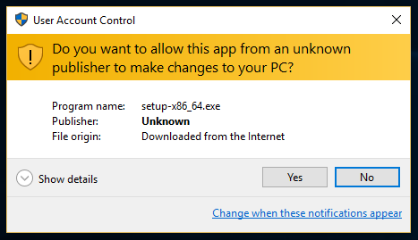

**Recommended:** Just click `Next`

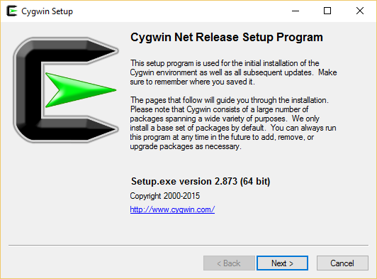

**Recommended:** Just click `Next`

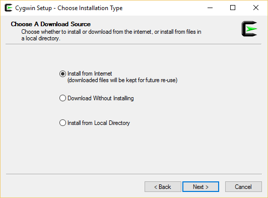

**Recommended:** Just click `Next`

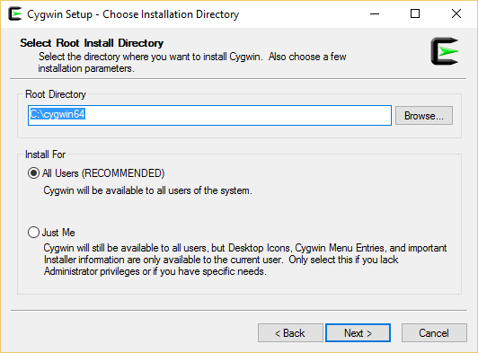

**Recommended:** Just click `Next`

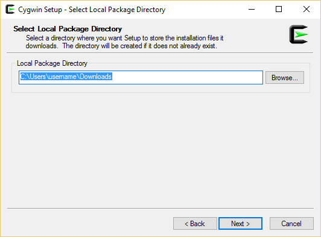

**Recommended:** Just click `Next`

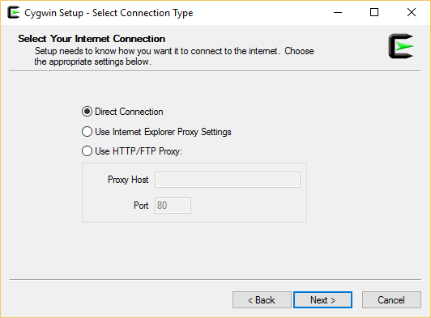

**Recommended:** Just click `Next`

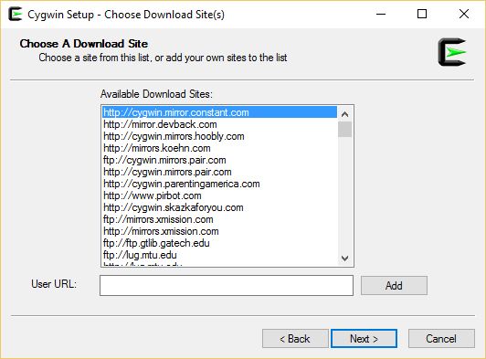

**Recommended:** Just click `Next`

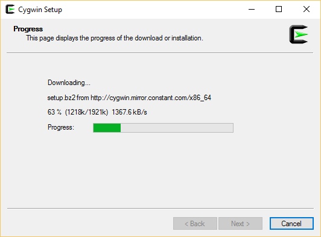

You will now see a screen similar to this. This is where we must search for and install our required programs.

> **Important note:** You don't need to install every program you can think of now, you can simply re-run the set-up any time you need to update or add or remove programs.

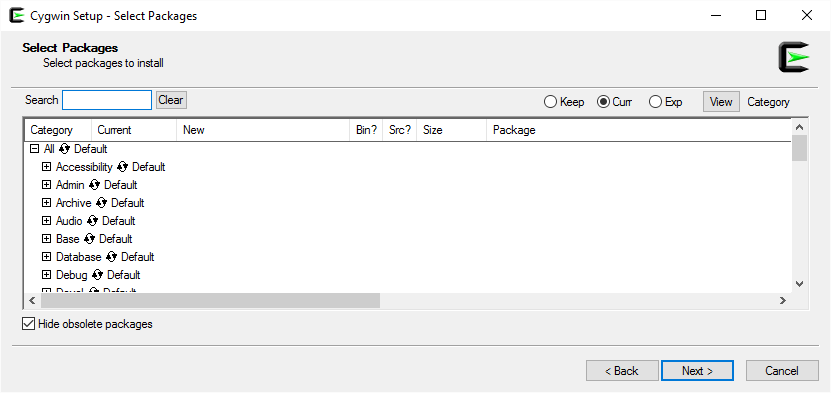

In this example we will search for `lftp` so that we can install it. You will see the results in the box below as your results are filtered.

> **Important note:** You can generally ignore the `Debug` category.

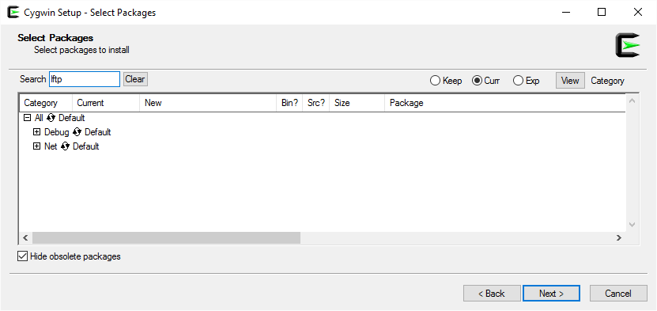

Expand the `Net` category and we will be shown a list of filtered results. The one result here is for the program `lftp` and it is not installed as it is marked `Skip`.

> **Important note:** `Skip` means the program is not installed by default and must be selected for installation manually.

Now if we click on `Skip` we can begin to cycle through the available options. For this example we want to be shown the most current version number and leave it set to that.

> **Important note:** These options can change depending or not on whether a program is installed already. So you can just cycle through them until you have the option you require.

Using the same method you can now filter for and select `openssh`

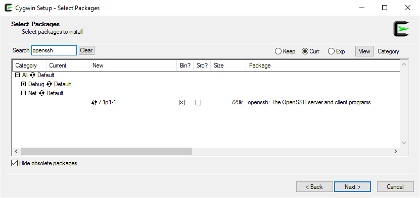

Using the same method you can now filter for and select `cron`

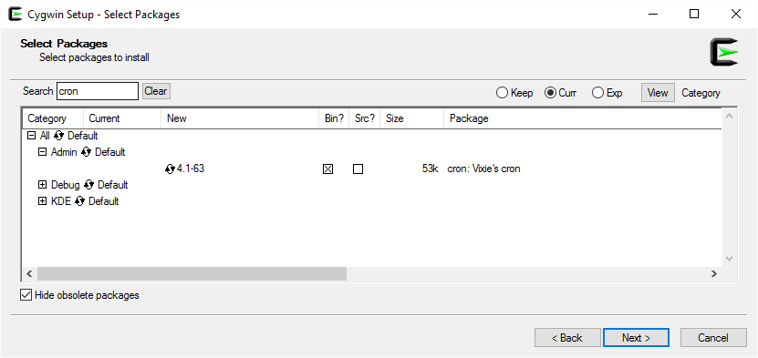

Using the same method you can now filter for and select `nano`

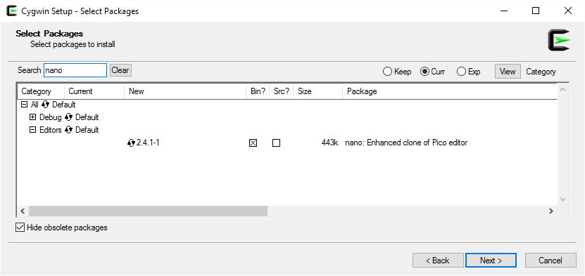

Using the same method you can now filter for and select `screen`

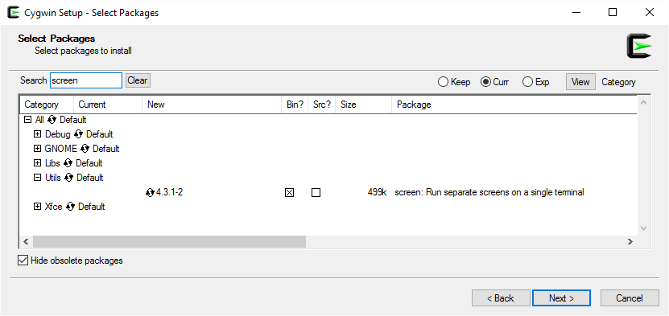

Using the same method you can now filter for and select `wget`

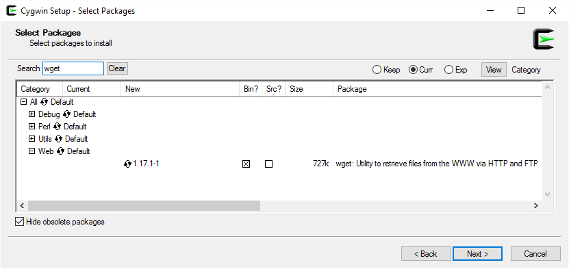

Using the same method you can now filter for and select `cygrunsrv`

Now we can click on `Next` to begin the installation process. You can browse over the packages and dependencies that will be installed here before continuing if required.

> **Important note:** the `Select required packages` box should already be checked. IF it is not already, then make sure you check it now.

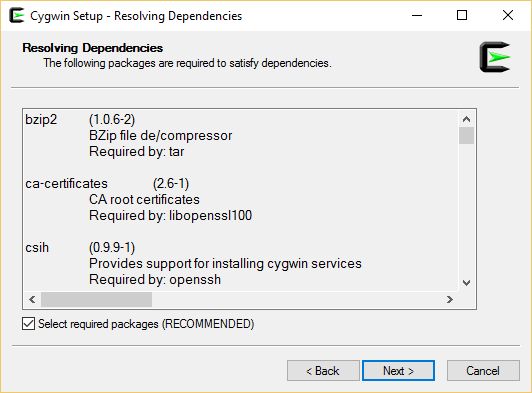

The files will now be downloaded and installed. You must wait until this stage is completed to move forward.

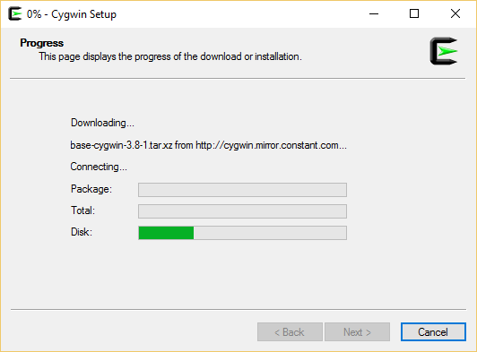

**Recommended:** Select both options to create an icon on the Desktop and to add an icon to the start menu then click next.

> **Important note:** If you did not do this or forgot to do this you can just rerun the Cygwin set-up program again and select these options.

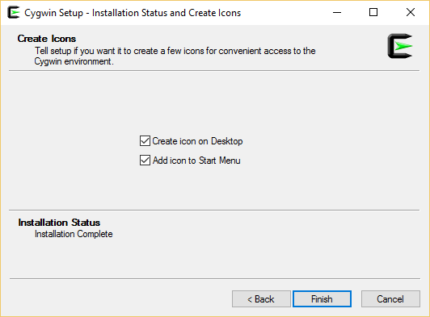

Find the Cygwin short cut on your desktop and run it.

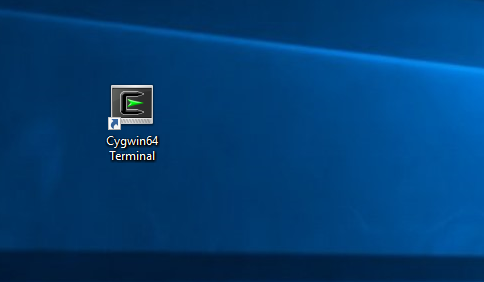

You will now see this for the first time when you open the Cygwin terminal.

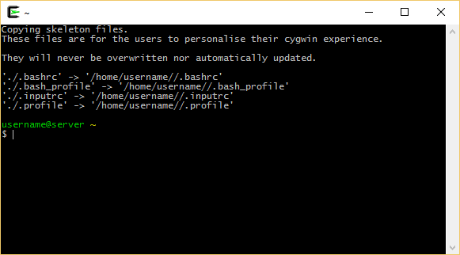

From now on you will simply see this when you open the Cygwin terminal

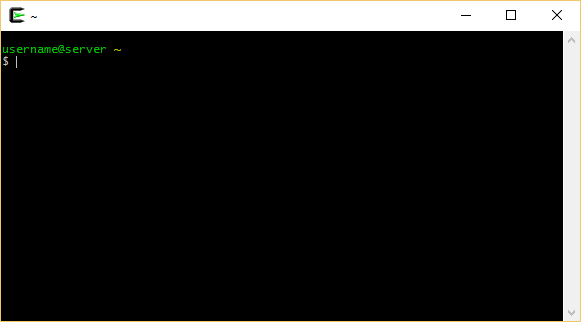

You have successfully installed Cygwin and the example applications.

Using lftp
---

You can now move on to this [lftp tutorial](https://github.com/userdocs/file-transfer/blob/master/Windows/Cygwin/lftp/readme.md)