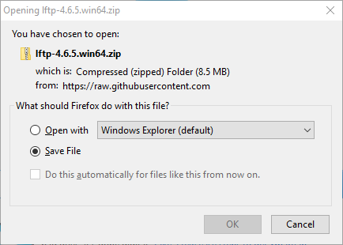
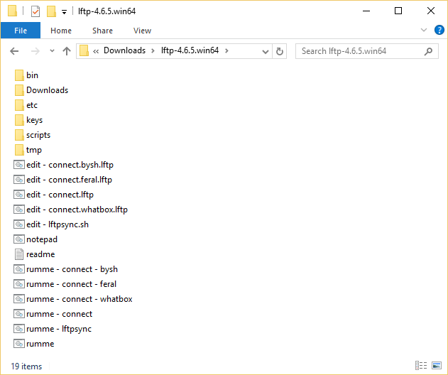
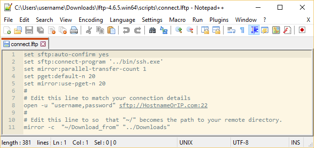
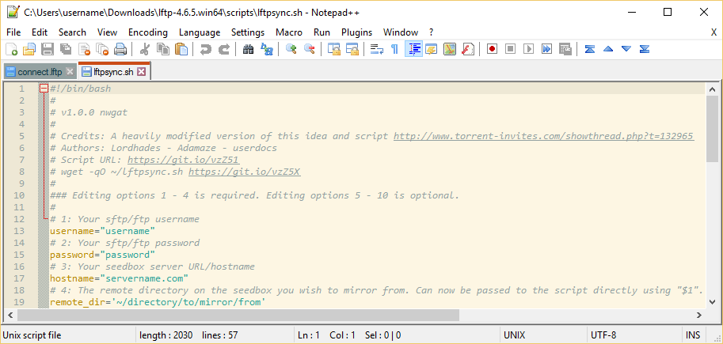
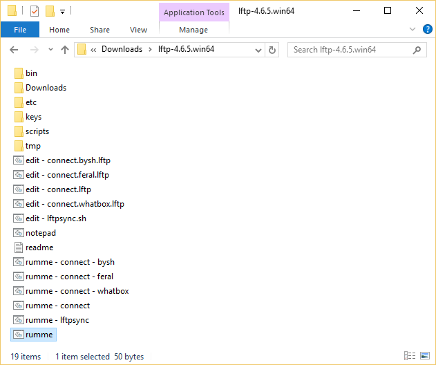
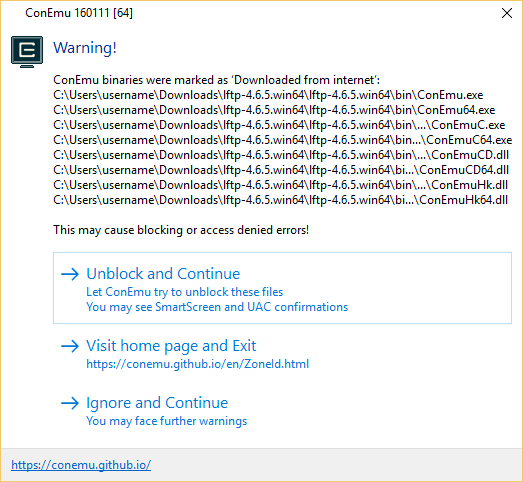
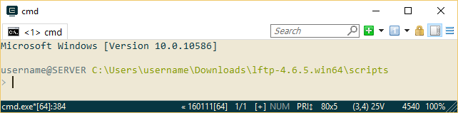
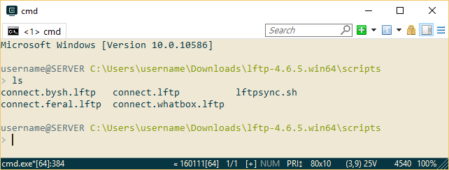
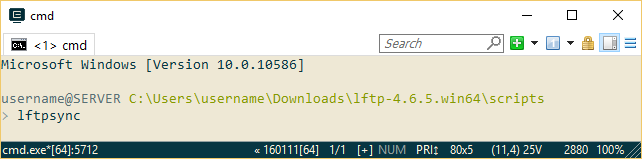

lftp guide
---

### lftp in a portable set-up on Windows using ConEmu

This project is based on the work and release from this page - [https://nwgat.ninja/lftp-for-windows/](https://nwgat.ninja/lftp-for-windows/)

What is this?
---

This is magic!

This project has taken a portable version of lftp on Windows, made from a Cygwin installation, and created a self contained and truly portable lftp solution on Windows that effectively only requires the end user to double click a preconfigured bat file. If there is no preconfigured template in place then it has been made as easy as possible for the end user to edit and use the existing templates.

**1:** Taken the `x64` portable release of `lftp` by [Nwgat](https://nwgat.ninja/) -  https://lftp.nwgat.ninja/lftp-4.6.5/lftp-4.6.5.win64-openssl.zip

**2:** Taken the `x64` portable version of [ConEmu](https://conemu.github.io/) - http://www.fosshub.com/ConEmu.html/ConEmuPack.150813f.7z

**3:** Added some extra Cygwin binaries like `rm ps mkdir bash` and more so that the standard `lftpsync.sh` script works seamlessly with this set-up.

**4:** Customised `ConEmu` to load relative to the Script directory and download and log locally to the portable folder. Start `ConEmu` and do `ls` to see this. This means you are always in the script folder to use your custom scripts.

**5:** Configured lots script templates, aliases and bat files to make running or editing files as simple as double clicking a bat file or using an alias in ConEmu.

**6:** Merged it all together with some tweaks to make it all just work.

The result: A truly portable and configurable `lftp` solution on Windows that can also run the well known `lftpsync.sh` script without actually needing to install Cygwin or any other program.

The potential is that a seed box company could provide a self contained lftp solution to the end user that they download, extract and double click. It really can be that easy and simple to use lfpt on Windows.

Usage
---

> **Important note:** Use the provided `edit` or `notepad` bat files to edit the provided scripts. It will use a preconfigured text editor to make sure the files are properly edited.

**1:** Download the zip file.

[lftp-4.6.5.win64.zip](https://git.io/vzoiB)

**2:** Extract this folder somewhere then enter the folder. This is what you will see. The `readme.txt` contain a run-down of the components and their function.

**3:** You need to edit the script files in the `Scripts` directory to have it work as intended, if you were not provided a customised template.

**Important note:** There is no conf/rc file with this set-up. You need to use an lftp script  with your required options and call that in ConEmu. It pretty much works out the same anyway.

run the `edit - connect.lftp.bat` file.

In the below example you need to edit two lines.

~~~
set sftp:auto-confirm yes
set sftp:connect-program '../bin/ssh.exe'
set mirror:parallel-transfer-count 1
set pget:default-n 20
set mirror:use-pget-n 20
#
# Edit this line to match your connection details
open -u "username,password"  sftp://HostnameOrIP:22
#
# Edit this line to so  that "~/" becomes the path to your remote directory.
mirror -c  "~/Download_from" "../Downloads"
~~~

This line must contain your personal connection info.

~~~
open -u "username,password"  sftp://HostnameOrIP:22
~~~

This line must be changed so that `"~/Download_from"` links to a valid remote directory.

~~~
mirror -c  "~/Download_from" "../Downloads"
~~~

Then save your changes and you are ready to use this script

run the `edit - lftpsync.sh.bat` file.

> **Important note:** For the `lftpsync.sh` script you must edit these 4 lines:

~~~
# 1: Your sftp/ftp username
username="username"
# 2: Your sftp/ftp password
password="password"
# 3: Your seedbox server URL/hostname
hostname="servername.com"
# 4: The remote directory on the seedbox you wish to mirror from. Can now be passed to the script directly using "$1". It must exist on the remote server.
remote_dir='~/directory/to/mirror/from'
~~~

**4:** Double click on the `runme.bat` to load the `ConEmu` terminal.

> **Important note:** If you get a warning about the files being from the internet when running `ConEmu` you can safely ignore it. The files are unmodified and a checksum comparison of the same version would confirm that. If you are still not sure you can simply download the portable preview zip yourself and copy the files over to the `bin` directory. What holds the changes is the `ConEmu.xml`.
.bat`

Once you have run the `runme.bat` you will see this screen.

Then type the command `ls` to show a listing of all current scripts. You can use `TAB` auto complete.

> **Important note:** You need to have properly edited the related script file before you try to run it or it will fail.

To connect to a configured server using an existing template enter one of these aliases:

~~~
lftpsync
connect
bysh
feral
whatbox
~~~

Bat files usage
---

You may notice there are two extra bat files. These are linked to the edited scripts above but run then automatically instead of requiring user input and automatically minimise `ConEmu` to the taskbar.

~~~
edit - lftpsync.sh.bat will open the included notepad ++ and the lftpsync script for you to edit and save.

edit - connect.lftp.bat will open the included notepad ++ and the connect.lftp script for you to edit and save.

edit - connect.bysh.bat will open the included notepad ++ and the connect.bysh.lftp script for you to edit and save.

edit - connect.feral.bat will open the included notepad ++ and the connect.feral.lftp script for you to edit and save.

edit - connect.whatbox.bat will open the included notepad ++ and the connect.whatbox.lftp script for you to edit and save.

notepad - This will open notepad ++ in the main directory. This will allow you to open a file and be in the portable directory to begin with.

runme will open ConEmu in the script folder but not run or do anything. Aliases have been configured to make running the scripts easy.

lftpsync
connect
bysh
feral
whatbox

runme - lftpsync.sh will run the lftpsync.sh script and automatically minimise ConEmu to the task bar.

runme - connect.lftp will run the connect.lftp script and automatically minimise ConEmu to the task bar.

runme - connect..bysh.lftp will run the connect..bysh.lftp script and automatically minimise ConEmu to the task bar.

runme - connect.feral.lftp will run the connect.feral.lftp script and automatically minimise ConEmu to the task bar.

runme - connect.whatbox.lftp will run the connect.whatbox.lftp script and automatically minimise ConEmu to the task bar.
~~~

Windows Task Scheduler
---

WIP

