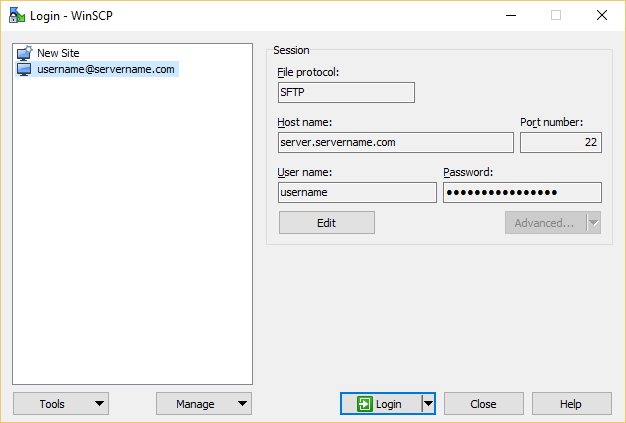
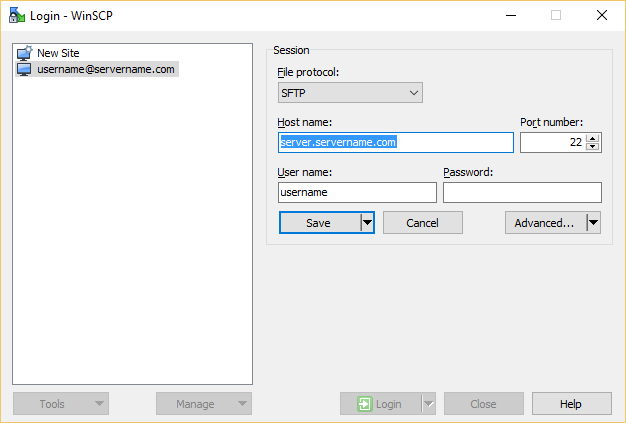

WinSCP Portable - Notepad ++ Portable - Kitty Portable
---

`winscp.putty.feral` is a mini project that aims to make life simpler by being %100 portable and with pre set configuration tweaks. A portable and self contained solution.

So what is this?

This repo includes

- notepad ++ - portable installation

- winscp - Portable using the `winscp.ini` top store settings

- kitty (portable) - that single binary.

- kageant renamed to pageant for use with pass phrase protected keyfiles.

These are set up to work together using a preconfigured `winscp.ini` file.

Such things like:

- Unicode forced
- time-out time increased
- Uses the notepad ++ as the default editor
- Some GUI tweak such as displaying the custom command ribbon by default.
- Add custom commands.
- Easy SSH access using kitty portable + pageant (renamed from kageant)

Load up WinsSCP and this is waht you will see.

The user is required to edit the existing template session:

They are required to use their personalised information provided by their host.